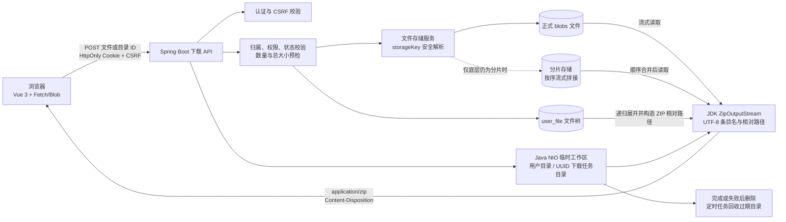
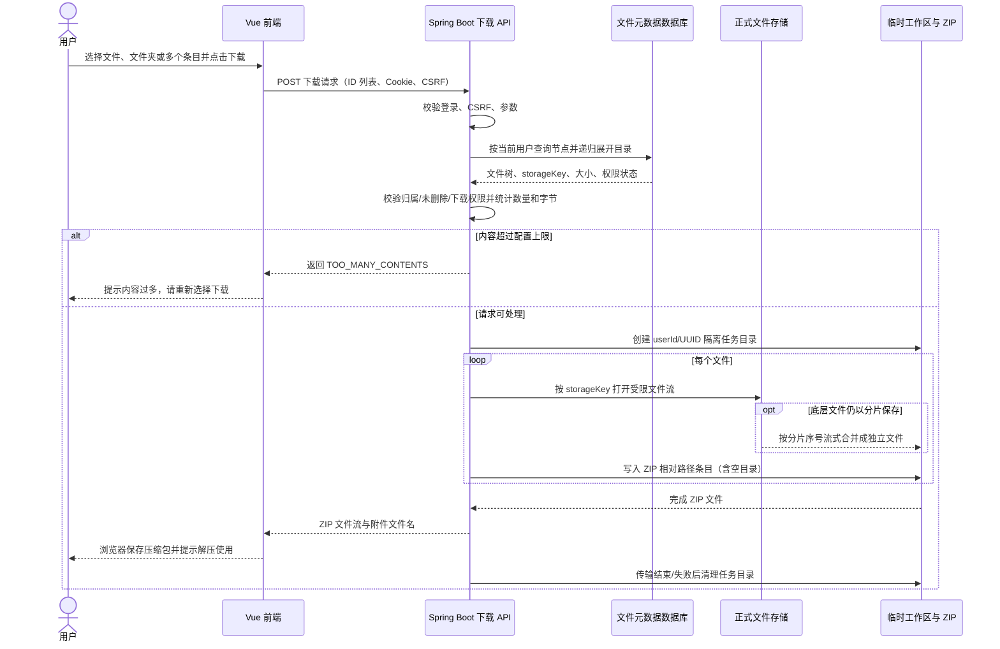

# 文件下载

## 压缩下载技术选型

## 压缩下载系统链路

## 单文件接口

`GET /api/v1/files/file/download?filename=说明.txt&fileId=123`

- 必须登录。`filename` 必填；缺失或空白返回 `401 / INVALID_PARAM`。`fileId` 可选，列表页和预览页始终传入它，以区分不同目录中的同名文件。
- 仅传 `filename` 时，当前用户只有一条同名有效文件记录才允许下载；多条同名记录返回 `409 / NAME_CONFLICT`，需要补充 `fileId`。
- `UserFile` 是文件的视图记录。后端在读取磁盘之前校验记录存在、当前用户归属、未软删除、文件类型，以及 `downloadAllowed` 和 `previewAllowed` 均为真。校验失败统一返回 `404 / FILE_NOT_FOUND`。
- 成功返回 `200` 文件流，`Content-Type: application/octet-stream`、`Content-Disposition: attachment` 和 `Cache-Control: no-store`。文件名使用 UTF-8 编码。磁盘路径不得越过当前用户的存储目录。
- 未登录返回 `401 / UNAUTHORIZED`，与参数错误的业务码区分。其他错误沿用 `Result` 响应格式。

## 页面与批量操作

- 文件列表每个文件提供单文件下载按钮；选择文件或文件夹后可批量打包下载，回收站不提供下载入口。
- 列表复用删除操作的复选框；“批量下载”请求 `POST /api/v1/files/files/download`，提交 `{ "ids": [123, 456], "downloadName": "项目资料" }` 并下载 ZIP。选择文件夹时递归保留目录结构和空文件夹；每个文件先流式复制到独立任务目录，再写入 ZIP。任务目录位于 `${DOWNLOAD_TEMP_ROOT}/{userId}/{downloadName}-{UUID}`，响应结束后清理，超过 24 小时的遗留目录每小时回收。单次最多 1000 个文件/目录节点，文件总大小最多 1 GiB；超过限制返回“内容过多，请重新选择下载”。
- 目录可递归打包；被权限标记禁止的文件会拒绝整个请求。浏览器收到完整 ZIP 后发起保存；提示为“已开始下载”，不代表用户已完成本地保存。
- `downloadAllowed` 或 `previewAllowed` 为假时，列表下载按钮禁用并提示“该文件不支持下载”。预览被禁止时后端拒绝预览请求。
- 当前数据模型没有管理权限标记的页面或接口；新旧记录默认允许下载和预览。若手工维护数据库结构，需为 `user_file` 增加默认值为 `true` 且非空的 `download_allowed`、`preview_allowed` 列。

## 验证

运行后端 `mvn test`、前端 `npm test`、`npm run build` 和 `npm run test:e2e`。回归覆盖同名文件、用户归属、软删除、权限标记、路径边界、参数错误及列表与预览页下载交互。
